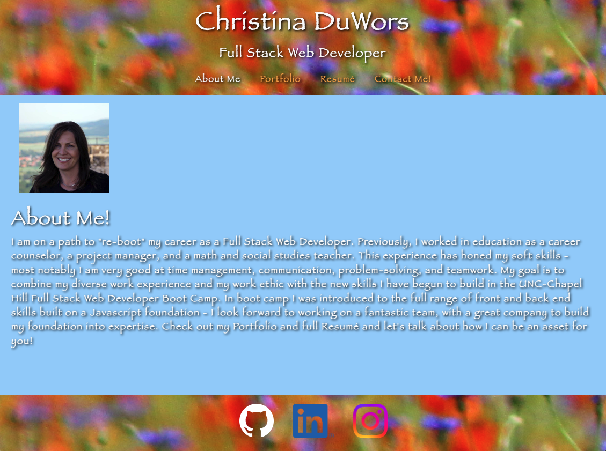

# Christina DuWors' React Portfolio

## Description

This is an introductory Portfolio designed to showcase my experiences and projects created during my time enrolled in the UNC Chapel Hill Full-Stack Web Development Boot Camp.  This portfolio is a single-page application built on a `React` foundation.

React skills showcased in this project:

- Reusable components within the React application.

- Managed state within React components.

- Props passed to child components.

- Utilizes React Hooks to manage state in functional components.

- Conditional rendering of components based on updates to state.

View the Deployed site here: https://cduwors.github.io/React-Portfolio/

## Table of Contents

- [Installation](#installation)
- [Usage](#usage)
- [Issues](#issues)
- [License](#license)
- [Contributing](#contributing)
- [Questions](#questions)
- [Images](#images)

## Installation

This is not intended for external installation.

## Usage

This portfolio is designed as a showcase a diversity of work samples that will be helpful to an employer to determine if my skill set aligns with their job needs.

## Issues

More project representation is needed. I will be looking to upgrade with more work examples as I continue to build my experience.

## License

This project is not currently licensed.

## Contributing

No external contributions are applicable. However, I am happy for some constructive criticism on how I can improve the overall quality or content of the portfolio!

## Questions

See more details at https://www.github.com/cduwors or contact cduwors@mail.com.

GitHub Repository: https://github.com/cduwors/React-Portfolio

## Images

Home Page:

